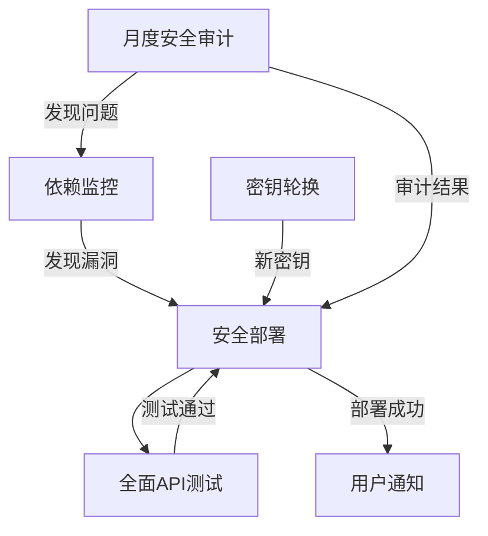

# GitHub Actions 工作流说明

本项目包含以下自动化工作流：

## 1. 依赖监控 (dependency_monitor.yml)
- **触发条件**: 
  - 每天UTC时间8点自动运行
  - 当`requirements.txt`、`pyproject.toml`或`Pipfile`变更时触发
  - 支持手动触发
- **功能**:
  - 检查依赖漏洞(safety)
  - 审计Python包(pip-audit)
  - 静态代码分析(bandit)
  - 发现关键漏洞时通知团队
- **高级选项**:
  - 支持忽略特定漏洞(通过`tools/analyze_vulnerabilities.py`配置)

## 2. 安全部署 (deploy.yml)
- **触发条件**: 
  - 推送到`main`或`release/*`分支
  - 手动触发(可强制部署)
- **功能**:
  - 环境验证和加密
  - 依赖验证
  - 安全扫描(可配置最低严重性)
  - 带自动回滚的部署
  - 部署后验证
- **高级选项**:
  - 强制部署模式(跳过安全检查)
  - 部署前完整备份

## 3. 全面API测试 (full_test.yml)
- **触发条件**: 
  - 推送到`main`或`develop`分支
  - 向`main`分支的Pull Request
  - 工作日UTC时间18点自动运行
  - 手动触发(可选择完整覆盖率测试)
- **功能**:
  - 并行运行API测试
  - 生成测试覆盖率报告(可配置最低覆盖率)
  - 测试失败时详细分析
  - 测试结果通知团队
- **高级选项**:
  - 完整覆盖率测试模式(额外性能测试)

## 4. 密钥轮换 (key_rotation.yml)
- **触发条件**: 
  - 每季度首日午夜自动运行
  - 手动触发(可强制轮换)
- **功能**:
  - 多因素认证验证
  - 检查密钥年龄(默认最小90天)
  - 安全生成和验证新密钥
  - 更新系统配置
  - 归档旧密钥(加密存储)
  - 完整的回滚机制
- **高级选项**:
  - 强制轮换模式(跳过验证)

## 5. 月度安全审计 (security_check.yml)
- **触发条件**: 
  - 每月1日自动运行
  - 支持手动触发(可选择完整扫描)
- **功能**:
  - 综合安全扫描(safety, bandit, pip-audit, semgrep)
  - 可配置最低严重性等级
  - 生成详细审计报告(含修复建议)
  - 自动提交审计日志
  - 上传安全报告到GitHub代码扫描
  - 通知审计结果
- **高级选项**:
  - 完整扫描模式(生成修复建议)

## 工作流关系图

**最佳实践建议**:
1. 定期检查依赖监控报告(每日)
2. 部署前确保:
   - 所有测试通过
   - 无关键安全问题
   - 覆盖率达标
3. 密钥轮换后:
   - 验证所有服务
   - 检查监控系统
4. 每月审查安全审计报告:
   - 优先处理关键问题
   - 实施修复建议
5. 关键操作后:
   - 检查所有通知
   - 验证系统状态
6. 使用强制模式时:
   - 记录操作原因
   - 后续进行完整验证

**紧急情况处理**:
- 对于关键漏洞，可使用强制部署立即修复
- 系统异常时可使用密钥轮换的回滚机制
- 测试失败时可临时降低覆盖率要求